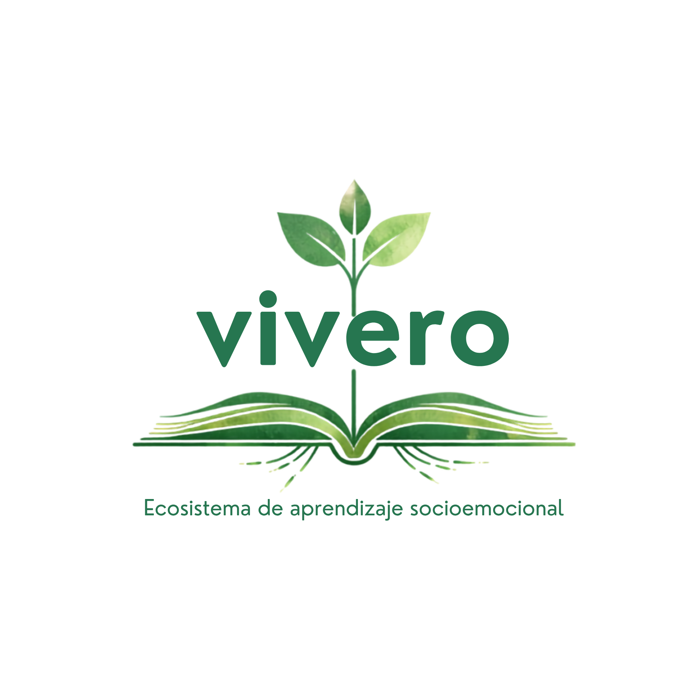

<p align="center">
  
</p>

# 🌳 Vivero

> Una herramienta para diseñar experiencias de aprendizaje e integrar el aprendizaje socioemocional en la planeación curricular.

## 🪴 Descripción

**Vivero** es una aplicación web desarrollada para promover la integración del aprendizaje socioemocional en las áreas académicas y apoyar su planeación curricular. Su propósito es facilitar la organización de indicadores, la identificación y priorización de habilidades socioemocionales, y la planificación de experiencias de aprendizaje orientadas al desarrollo de los aprendizajes esenciales, según los cursos de vida y los grupos etarios, en un entorno claro, flexible y fácil de usar.

Este ecosistema virtual permite construir la planeación de manera estructurada, editar la información en cualquier momento y generar documentos en formato PDF listos para compartir o imprimir.

**Desde Engativá, con amor.** 🌱

---

## 🌼 Propósitos

- Promover la integración del aprendizaje socioemocional en la planeación curricular.
- Facilitar la identificación y priorización de habilidades socioemocionales según los cursos de vida y los grupos etarios.
- Organizar la información curricular de manera clara, flexible y estructurada.
- Favorecer la construcción de experiencias de aprendizaje contextualizadas.
- Generar documentos en formato PDF para su consulta, impresión o socialización.

---

## 🌿 Características

- Planeación curricular organizada por períodos académicos.
- Integración de habilidades socioemocionales en la planeación.
- Priorización de habilidades socioemocionales según cursos de vida y grupos etarios.
- Gestión de indicadores de aprendizaje.
- Constructor de laboratorios pedagógicos.
- Edición de la planeación en cualquier momento.
- Guardado automático de la información en el navegador.
- Generación de documentos en formato PDF.
- Funcionamiento sin necesidad de conexión a internet.
- Interfaz clara, intuitiva y adaptable al trabajo docente.

---

## 🍃 Tecnologías utilizadas

Vivero ha sido desarrollado con tecnologías web estándar, priorizando la simplicidad, el rendimiento y la facilidad de mantenimiento.

- **HTML5** – Estructura de la aplicación.
- **CSS3** – Diseño de la interfaz y estilos responsivos.
- **JavaScript (Vanilla)** – Lógica y funcionamiento de la aplicación.
- **LocalStorage** – Almacenamiento local de la información.
- **jsPDF** – Generación automática de documentos en formato PDF.

---

## 🌱 Acceso

Vivero es una aplicación web que funciona directamente desde el navegador, por lo que no requiere instalación.

Para comenzar, solo debes acceder a la aplicación desde el siguiente enlace:

🔗 **https://jeasonmatteusw-lang.github.io/vivero/**

Se recomienda utilizar la versión más reciente de Google Chrome, Microsoft Edge o Mozilla Firefox para una mejor experiencia.

---

## 🌾 ¿Cómo usar Vivero?

El flujo de trabajo en Vivero es sencillo:

1. Crea una nueva planeación curricular.
2. Organiza la información de tu institución, grado y período académico.
3. Integra las habilidades socioemocionales y los aprendizajes esenciales.
4. Diseña las experiencias de aprendizaje y construye los indicadores de desempeño en el laboratorio.
5. Revisa y edita la información cuando lo necesites.
6. Genera el documento final en formato PDF.

---

## 🌳 Estructura del proyecto

```text
Vivero/
├── index.html        # Interfaz principal
├── styles.css        # Estilos de la aplicación
├── script.js         # Lógica y funcionamiento
├── datos.json        # Datos base del sistema
├── logo.png          # Identidad visual
└── README.md         # Documentación
```

---

## 🍂 Almacenamiento

Vivero almacena la información de forma local en el navegador mediante **LocalStorage**.

Esto permite conservar la planeación entre sesiones sin necesidad de crear una cuenta o conectarse a un servidor. La información permanece disponible en el mismo navegador y dispositivo donde fue creada.

> **Importante:** si se borran los datos de navegación o se cambia de navegador o dispositivo, la información almacenada localmente no estará disponible.

---

## 🌺 Próximas versiones

Vivero continúa creciendo. Entre las funcionalidades previstas para futuras versiones se encuentran:

- 💾 Copias de seguridad de la información.
- 📤 Exportación e importación de planeaciones.
- ☁️ Sincronización entre dispositivos.
- 👥 Trabajo colaborativo entre docentes.
- 🏫 Personalización para instituciones educativas.
- 📱 Aplicación móvil para Android e iOS.

---

## 🧙‍♂️ Autor

**Jeason Mateus**

_Escuchante · Ciudadano · Reeducador_

---

## 📜 Licencia

Vivero es un proyecto desarrollado con fines educativos y **sin ánimo de lucro**.

**Creado con amor para la comunidad educativa.** 🌱

© 2026 Jeason Mateus. Todos los derechos reservados.